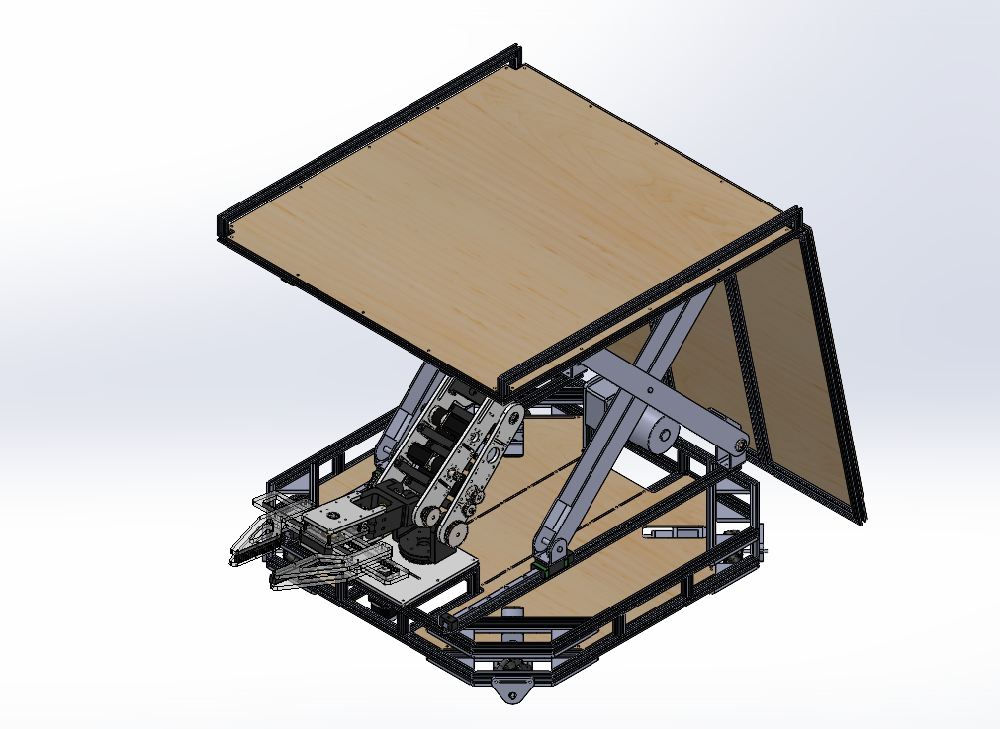
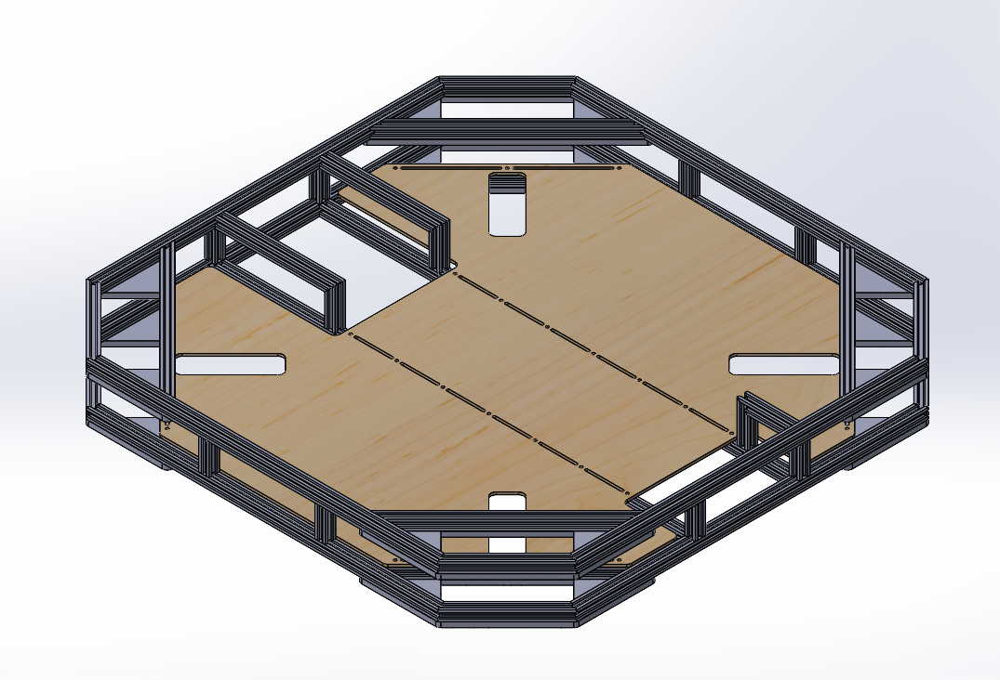
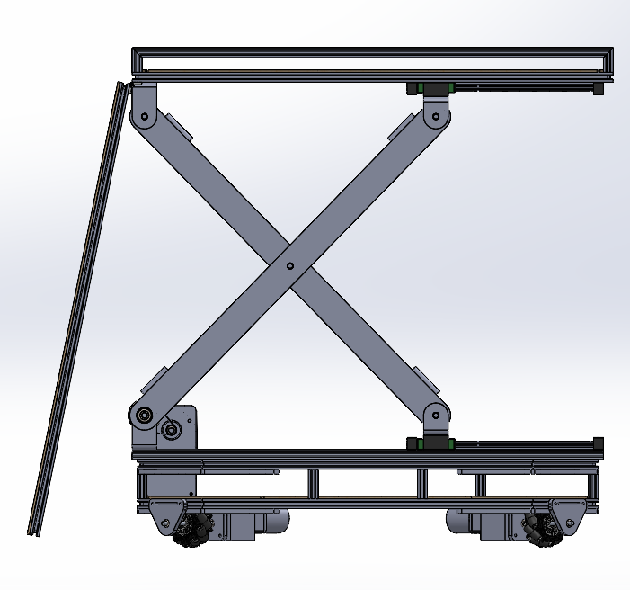

# ABU-Robot-2026-AMR-Robot

An AMR robot designed to compete in the ABU Robot 2026 competition.

## Preview



## Purpose

The ABU Robot 2026 competition requires teams to design two robots: **R1**, a semi-autonomous robot, and **R2**, a fully autonomous robot. In some competition tasks, **R1 must be capable of carrying R2 on top of it** while performing the required tasks.

The main objective of this project was to design **R1**. After developing 4 major design iterations, the final concept, **R1 Delta**, was developed with a scissor-lift elevator and a ramp system for transporting R2.

R1 Delta uses **mecanum wheels** to provide omnidirectional movement, allowing the robot to move laterally without changing its orientation. The chassis was designed to withstand a **40 kg payload while operating at maximum speed**, providing sufficient strength and mobility for the competition requirements. The robot was also designed to integrate with a [5-axis manipulator robotic arm Mk3](https://github.com/NatthanantTantitaranukul/ABU-Robot-2026-Robot-Arm-Mk-3).

## Design
### Frame

The frame was designed with a rectangular layout to maximize the available space for mechanical mechanisms and electronic components while keeping the overall design compact enough to accommodate both the lifting mechanism and robotic arm.

The main structure uses aluminum profiles to provide sufficient strength while simplifying assembly and modification. Wooden panels were used for the plate sections to reduce cost and weight compared with the previous design, which used acrylic.

The frame also incorporates rectangular openings for mounting the DC motors, mecanum wheels, and front LiDAR sensor.

### Liftand Ramp mechanism

**Lift Mechanism**

The lifting mechanism was designed specifically to support the heavy load of **R2**. Laser-cut metal sheets were used for the main structural components to provide sufficient strength while keeping the design relatively simple to manufacture.

A scissor-lift mechanism with linear guides was used to provide stable vertical movement. Linear guides were chosen instead of guide rods to improve stability and reduce the risk of bending or damaging the guides under heavy loads.

The scissor lift is driven by a motor connected to a sling-based pulling mechanism at the rear of the lift. This approach was selected instead of using gears or timing pulleys to simplify the transmission system and provide a suitable solution for lifting the heavy **R2** platform.

**Ramp Mechanism**

The ramp uses a simple gravity-assisted mechanism. When the lift moves downward, the ramp automatically lowers into position, allowing **R2** to move onto the lifting platform without requiring a separate motor or actuator.

## Project Status

The **R1 Delta** project was discontinued before the final manufacturing and testing stages due to insufficient funding to participate in the ABU Robot 2026 competition. The mechanical design and several design iterations were completed, including the frame, scissor-lift mechanism, ramp system, and integration concept for the [5-axis manipulator robotic arm Mk3](https://github.com/NatthanantTantitaranukul/ABU-Robot-2026-Robot-Arm-Mk-3).

Although the robot was not completed for competition, the project provided practical experience in mechanical design, system integration, material selection, and iterative development under competition requirements. The team subsequently decided to shift its focus to another competition.

Currently The team is focusing on replicating the robot for use in simulation, currently on gazebo harmonic and rviz2 alone.

## Digital Twining

For simulating the robot in gazebo and rviz, follow these steps:

```bash
cd ~/<ros2_ws>
git clone https://github.com/NatthanantTantitaranukul/ABU-Robot-2026-AMR-Robot.git
colcon build
source install/setup.bash
```

Currently only MK_3 arm has been completed. You can visualize it as follows:

```bash
ros2 launch urdf_tutorial display.launch.py model:=src/digital_twin/urdf/MK_3.urdf.xacro
```

